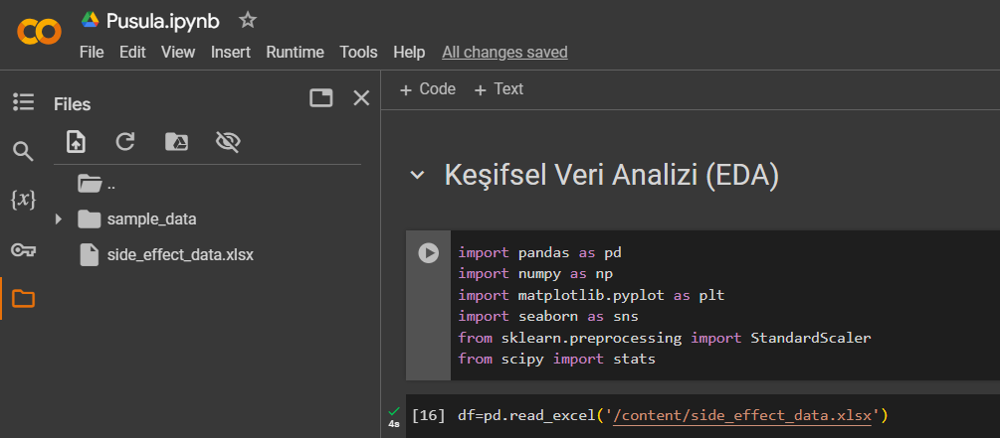
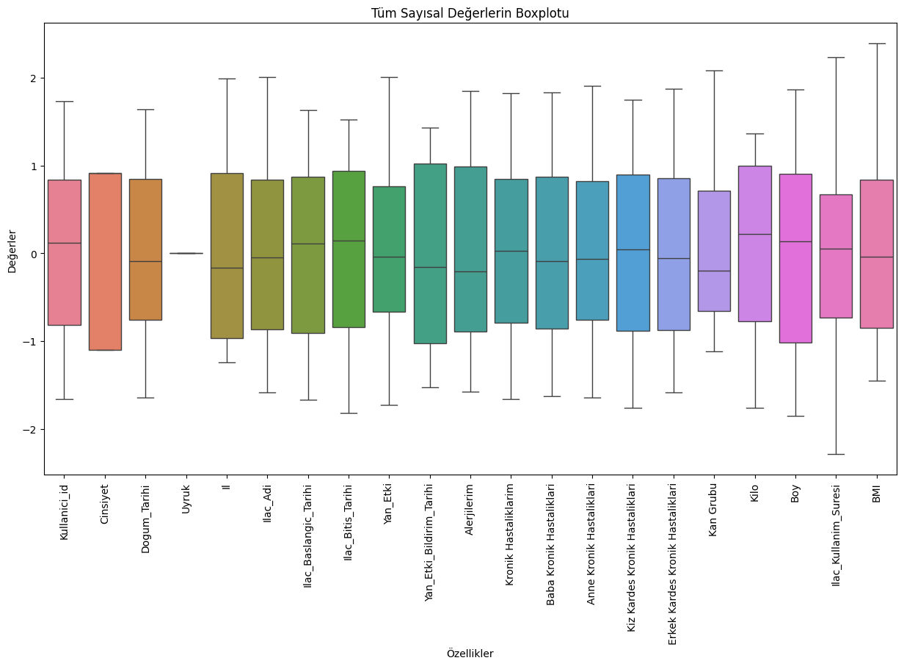
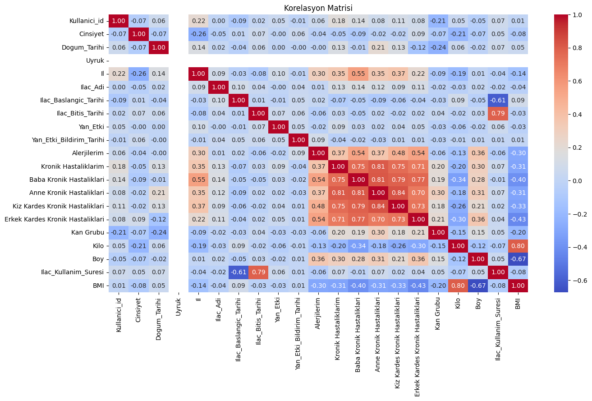

- **Elif Karadeniz - karadenizelif45@gmail.com**

# Sağlık Verisi Analizi Projesi
Bu proje, sağlık verileri üzerine keşifsel veri analizi (EDA) ve veri ön işleme süreçlerini içermektedir. İlaç kullanım süresi, vücut kitle indeksi (BMI) gibi özellik mühendisliği süreçleri ile hastalık, ilaç ve yan etkiler arasındaki ilişkiler incelenmiştir. Proje, sağlık verilerini daha anlamlı hale getirip analiz edilebilir bir forma dönüştürmeyi hedeflemektedir.

## Gereksinimler
Bu projeyi çalıştırmak için aşağıdaki Python kütüphanelerine ihtiyacınız olacaktır:

- pandas
- numpy
- matplotlib
- seaborn
- scikit-learn

## Keşifsel Veri Analizi(EDA)
- Bu projede ilk olarak veri seti yüklenip incelenmiş, temel bilgilere ulaşmak amacıyla sütun ve satır yapısı, veri tipleri, eksik değerler analiz edilmiştir. Boy ve kilo arasındaki negatif korelasyon tespit edilmiştir. Alerji sıklıkları incelendiğinde en çok domatese, en az ise kolalı içeceklere karşı alerji olduğu belirlenmiştir. Hipertansiyon en yaygın kronik hastalık olarak öne çıkarken, kan hastalıkları ve astım için en sık kullanılan ilacın hydrocortisone cream olduğu görülmüştür. Ayrıca, alerji ve kronik hastalıklar ilişkisi analiz edilmiştir; örneğin, Alzheimer ve astım hastalarında en yaygın alerjinin karaciğer olduğu tespit edilmiştir. Yan etkiler incelendiğinde, ağızda farklı tat en sık karşılaşılan yan etki olurken, deride morarma en az görülen yan etki olarak kaydedilmiştir. Hastalıklara özel yan etkiler arasında kalp hastalıklarında yorgunluk, hipertansiyonda tansiyon yükselmesi ve diyabette ağızda farklı tat en çok karşılaşılan yan etkiler olmuştur. Ayrıca, boy ve kilo dağılımlarına bakıldığında, kiloların çoğunlukla 70-100 kg aralığında, boyların ise 160-190 cm arasında yoğunlaştığı gözlemlenmiştir.

## Veri Ön İşleme
- Veri ön işleme aşamasında, öncelikle iki yeni özellik oluşturulmuştur: İlaç kullanım süresi, başlangıç ve bitiş tarihleri kullanılarak hesaplanmış, ve kilo ile boy verilerinden BMI (Vücut Kitle İndeksi) çıkarılmıştır. Bu yeni özellikler, kullanıcıların sağlık durumlarıyla ilişkilerini analiz etmek amacıyla eklenmiştir. Eksik veriler, özellikle demografik ve sağlık verilerini içeren sütunlardan temizlenmiştir. Tarih sütunları datetime formatına dönüştürülüp, sayısal hale getirilerek analiz ve modellemeye uygun hale getirilmiştir. Kategorik veriler, label encoding ile sayısallaştırılmıştır. Veriler arasındaki ölçek farklılıklarını gidermek için StandardScaler kullanılarak sayısal veriler standartlaştırılmıştır. Aykırı değerler Z-Score yöntemiyle belirlenmiş ve Boxplot ile görselleştirilmiştir;  bu sayede aykırı değerlerin olmadığından emin olunmuştur. Son olarak, korelasyon matrisiyle değişkenler arasındaki ilişkiler analiz edilmiştir.
 
- **Proje Dökümanı**
Proje ile ilgili daha fazla bilgi için [bu dökümana](pusula.pdf) göz atabilirsiniz.

- **Kodun Nasıl Çalıştırılacağına Dair Talimatlar**
- Kodu Google Colab ortamına yükleyip veri setini de aynı şekilde dosyalar kısmına upload ederek kodu çalıştırabilirsiniz. Bu aşama aşağıda görüldüğü gibidir:
  
 - 1- Google Colab'e giriş yapın ve proje dosyasını yükleyin.
 - 2- Google Colab'de veri setini "Files" kısmına yükleyin.
 - 3- Tüm hücreleri çalıştırın. Kod, veri yükleme, keşifsel veri analizi (EDA), veri ön işleme ve modelleme aşamalarını içerir.

- **Projeden Bazı Görselleştirmeler**
- Aykırı Değer - Boxplot
 
- Korelasyon (Isı Haritası)
 
